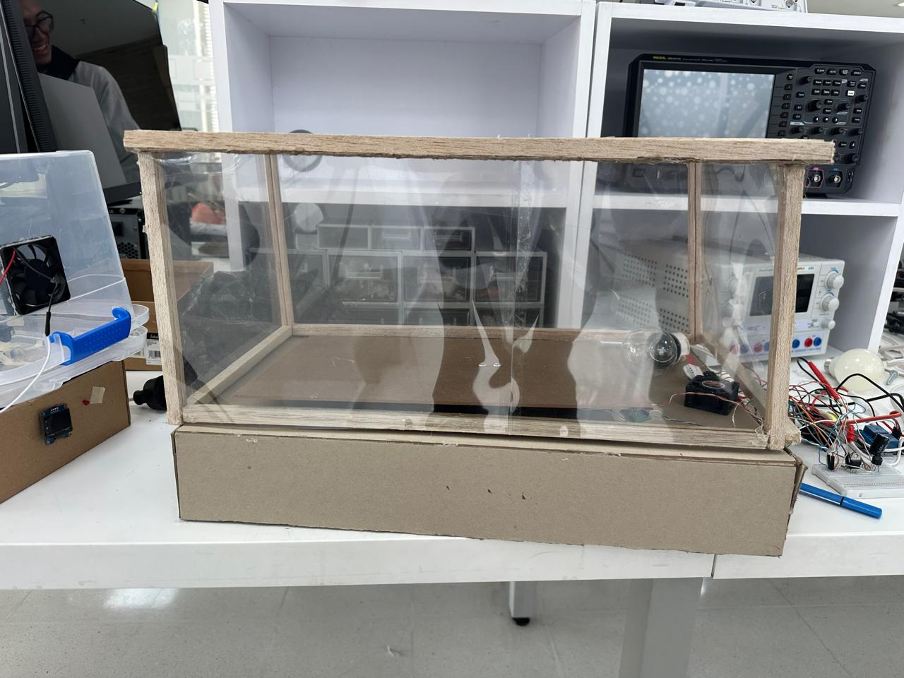
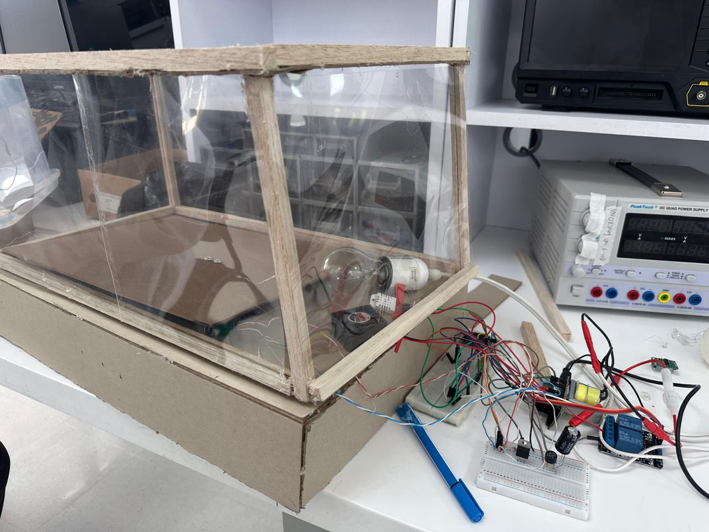
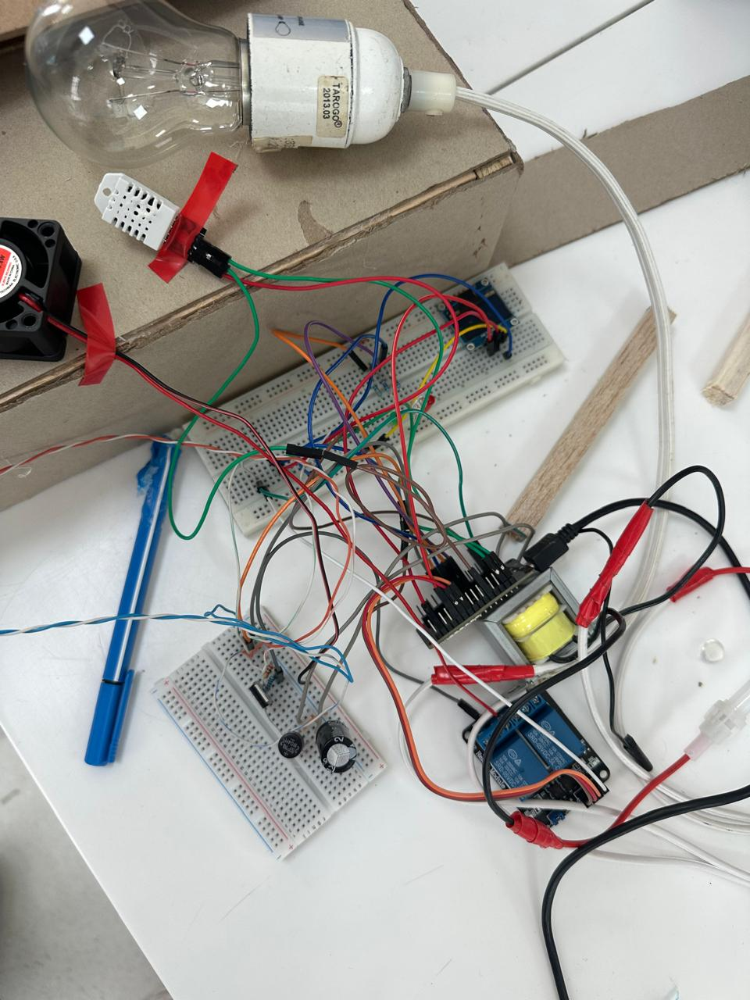
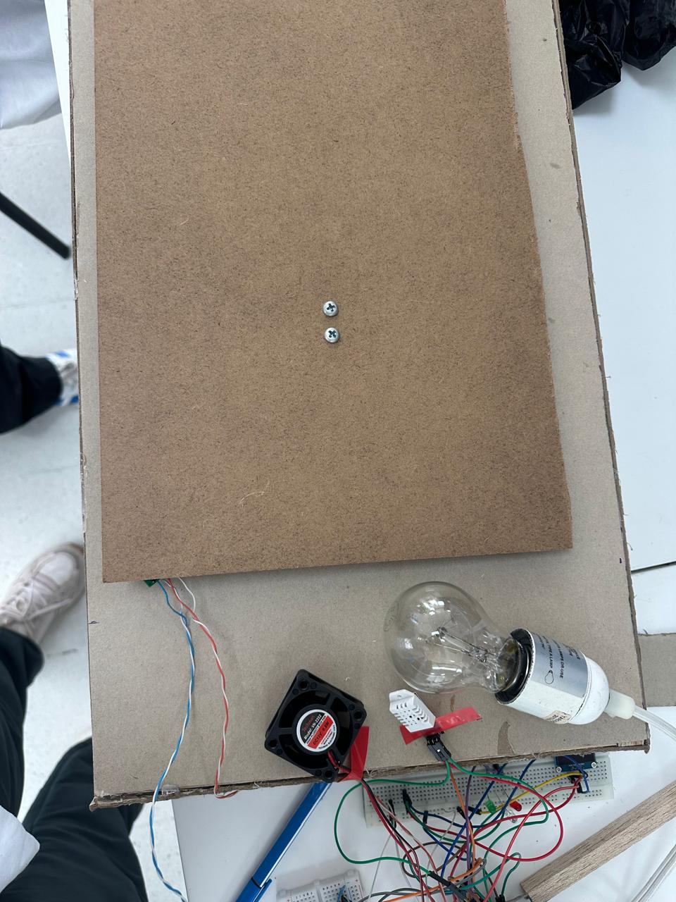

# LABORATORIO DISEÑO DE INCUBADORA NEONATAL

# PARTE A

- PARTES QUE COMPONEN UNA INCUBADORA NEONATAL

La incubadora neonatal es un equipo médico cerrado compuesto por una cámara o capacete de material transparente dentro del cual se coloca al neonato, un colchón sobre el que descansa el recién nacido, una plataforma, una base rodante que permite su movilización y un módulo de control en el que se concentran todos los parámetros del equipo (Pardell, s.f.). Este capacete o cúpula está fabricado generalmente en acrílico simple o doble, y cuenta con diferentes orificios y portillos que permiten tanto la manipulación del recién nacido como la entrada de equipos de ventilación, líneas de monitorización y vías venosas para la administración de medicamentos y alimentación parenteral, todo ello sin comprometer el microclima interior (EOS Meds, s.f.). A estos elementos se suman dos componentes estructurales fundamentales: la cúpula, fabricada en material acrílico que permite la observación continua del paciente, y el chasis, que constituye la base metálica sobre la cual se ensamblan los demás subsistemas, alojando en su interior la fuente de poder y los sensores de protección (Kalstein, 2021). El chasis, al ser la columna vertebral del equipo, debe garantizar la estabilidad mecánica de todos los módulos que conforman la incubadora, incluyendo el sistema de calefacción, el humidificador y el módulo electrónico de control, los cuales se encuentran típicamente ubicados en la parte inferior del compartimento del paciente (Pardell, s.f.). El sistema se completa con un humidificador o reservorio de agua, un puerto de entrada para el suministro de oxígeno, portillos de acceso laterales y frontales, y un sistema de alarmas tanto audibles como visuales (Rodríguez, 2018). Actualmente, gracias a los avances tecnológicos, la operación de estos equipos se basa en microprocesadores que, mediante algoritmos de control y medición, integran y gestionan de forma simultánea todas las funciones de la incubadora, permitiendo una respuesta precisa y continua ante cualquier variación de los parámetros programados (Pardell, s.f.). Las unidades más modernas incorporan adicionalmente sensores electrónicos con pantallas de monitoreo continuo y balanzas integradas que permiten registrar el peso del neonato sin necesidad de retirarlo de la incubadora, reduciendo así la manipulación innecesaria y los riesgos asociados a ella (EOS Meds, s.f.).

- FUNCIÓN DE CADA COMPONENTE

La cúpula cumple la función de aislar al neonato del ambiente externo, protegiéndolo de corrientes de aire, bajas temperaturas y agentes externos, mientras que el chasis provee el soporte estructural del equipo y aloja la fuente de alimentación eléctrica junto con los sensores que alertan ante cualquier falla del sistema (Kalstein, 2021). Es importante destacar que la cúpula debe cumplir características especiales de diseño: debe permitir la visibilidad total del bebé, estar fabricada con materiales que no reaccionen con el oxígeno para evitar la corrosión, y contar con puertas en sus caras frontales, laterales y posteriores, cada una cubierta con plástico especial para atenuar al máximo la pérdida de calor cada vez que el personal médico necesita acceder al paciente (Kalstein, 2021). El módulo de control permite seleccionar el modo de funcionamiento de la incubadora, ya sea en modo de control de temperatura del aire o en modo de control de temperatura de la piel del recién nacido, y los sistemas de calefacción y humidificación, ubicados debajo del compartimento, transfieren calor al neonato principalmente por el mecanismo de convección forzada (Pardell, s.f.). En el modo de control de temperatura de la piel, un sensor conectado directamente a la superficie corporal del neonato mide de forma continua su temperatura, y el sistema de calentamiento opera hasta que el paciente alcanza el valor de referencia establecido por el operador; si la temperatura supera el rango preestablecido, el sistema de calentamiento se inhabilita automáticamente y se activan las alarmas de seguridad (Rodríguez, 2018). El humidificador regula la humedad relativa del ambiente interior, el puerto de oxígeno permite fijar la fracción inspirada de oxígeno requerida por el paciente, los portillos de acceso facilitan la atención clínica del neonato reduciendo al mínimo la pérdida de temperatura interior, y el sistema de alarmas incrementa la seguridad del paciente al alertar al personal médico ante cualquier desviación de los parámetros establecidos (Rodríguez, 2018). Algunos equipos más avanzados combinan además las capacidades térmicas de una incubadora convencional con las ventajas de una unidad de calor radiante, permitiendo la conversión automática entre ambas configuraciones sin necesidad de transferir al paciente de un equipo a otro, lo cual reduce significativamente los riesgos asociados a la manipulación del neonato (Pardell, s.f.). Todo este conjunto de componentes trabaja de manera coordinada para evitar tanto la hipotermia como el sobrecalentamiento, condiciones que en los neonatos prematuros pueden derivar en daño cerebral, deshidratación o incluso la muerte, dado que estos pacientes pueden perder calor hasta cuatro veces más rápido que un adulto debido a su escasa grasa corporal y su mayor superficie corporal relativa (González, 2024). Esta vulnerabilidad se explica porque la piel del prematuro es más delgada que la de un neonato a término, y su capacidad metabólica para la producción de calor es limitada, por lo que cada uno de los componentes de la incubadora debe estar sincronizado y en perfecto funcionamiento para que el microambiente del neonato no se vea alterado en ningún momento (Kalstein, 2021).

- DISEÑO Y SIMULACIÓN DEL CIRCUITO DE TEMPERATURA

Para esto nos basamos del siguiente circuito, tal como se evidencia en el circuito de control de temperatura implementado por Restrepo-Pérez et al. (2007), el cual emplea reguladores LM317T y LM337T con trimmers para establecer los límites térmicos de 36 °C y 37,5 °C:

La simulación en proteus nos dio así: 

La primera etapa corresponde a la fuente de alimentación, representada por la fuente sinusoidal V1 (VSINE) de 120 V y 60 Hz, que alimenta el primario del transformador TR1 (TRAN-2P3S). Este transformador reduce el voltaje de entrada y genera dos salidas simétricas de ±6 V en corriente alterna, protegido en su entrada por un fusible que evita daños ante posibles sobrecarrientes. Estas dos salidas simétricas son indispensables para alimentar de forma independiente las dos ramas del sistema de control, correspondientes cada una a un límite térmico distinto.

La segunda etapa es la rectificación, llevada a cabo por el puente de diodos BR1 (BRIDGE), que convierte las señales alternas del transformador en señales de corriente continua pulsante. Al tratarse de un rectificador de onda completa, la frecuencia de la señal pulsante a la salida del puente es de 120 Hz, el doble de la frecuencia de entrada, aprovechando ambos semiciclos de la señal alterna para una mayor eficiencia en la conversión.

La tercera etapa corresponde al filtrado, realizado por los capacitores electrolíticos C1 y C2, ambos de 2200 µF. Estos capacitores de gran capacidad suavizan la señal pulsante proveniente del puente rectificador, entregando a la entrada de los reguladores una tensión de corriente continua estable con un rizado residual mínimo, garantizando así que las etapas de regulación reciban una alimentación limpia y libre de perturbaciones.

La cuarta etapa, y la más importante del sistema, es la regulación dual, compuesta por dos reguladores de voltaje ajustables que operan de forma simétrica. En la rama positiva, el regulador U1 (LM317T) trabaja en conjunto con el trimmer RV1 de 1 kΩ y la resistencia fija R1 de 220 Ω conectada al pin ADJ, lo que permite ajustar el voltaje de salida positivo de forma precisa. Este voltaje de salida regulado representa el umbral inferior de temperatura de 36 °C: cuando la temperatura interior de la incubadora se encuentra por debajo de este valor, el regulador entrega tensión a la salida, manteniendo activo el sistema de calefacción. El diodo D3 (1N4007) protege la salida del regulador ante posibles inversiones de polaridad, y el capacitor C4 de 0,1 µF filtra el ruido de alta frecuencia presente en la salida. De forma simétrica, en la rama negativa el regulador U2 (LM337T) opera con el trimmer RV2 de 1 kΩ y la resistencia R3 de 220 Ω, generando un voltaje negativo regulado que representa el umbral superior de 37,5 °C. Cuando la temperatura alcanza este límite, la acción del LM337T interrumpe la señal de activación del sistema calefactor, evitando el sobrecalentamiento del neonato. El diodo D4 (1N4007) y el capacitor C3 de 0,1 µF cumplen las mismas funciones de protección y filtrado que en la rama positiva.

La quinta y última etapa corresponde a la visualización del estado del sistema mediante dos LEDs indicadores. El LED verde D1, limitado en su corriente por la resistencia R2 de 470 Ω, se enciende cuando el regulador LM317T está activo, indicando visualmente al operador que el sistema de calefacción se encuentra en funcionamiento y que la temperatura interior está por debajo de los 36 °C. Por su parte, el LED amarillo D2, con su resistencia limitadora R4 de 470 Ω en la rama negativa, se enciende cuando el regulador LM337T actúa, señalando que la temperatura ha alcanzado el límite superior de 37,5 °C y que el calefactor debe apagarse. La combinación de estos dos indicadores visuales permite al personal médico conocer en todo momento el estado operativo del sistema de control térmico de la incubadora sin necesidad de instrumentos adicionales de medición.

Al ejecutar la simulación del circuito, se obtuvieron los siguientes resultados. En la entrada del circuito se observó una señal sinusoidal proveniente de la fuente V1 (VSINE) con una amplitud de 120 V y una frecuencia de 60 Hz, la cual alimenta el primario del transformador TR1 (TRAN-2P3S). En el secundario del transformador se obtuvieron dos señales alternas simétricas de ±6 V, desfasadas 180° entre sí, correspondientes a las ramas positiva y negativa del sistema de control.
Tras pasar por el puente rectificador BR1 (BRIDGE), la señal alterna se convirtió en una señal de corriente continua pulsante a una frecuencia de 120 Hz, es decir, el doble de la frecuencia de entrada, lo cual es el comportamiento esperado para un rectificador de onda completa. Posteriormente, los capacitores de filtrado C1 y C2, ambos de 2200 µF, suavizaron considerablemente esta señal pulsante, entregando a la entrada de los reguladores una tensión de corriente continua estable con un rizado residual mínimo, aproximadamente de 0,19 V pico a pico, lo que representa menos del 5% de variación respecto al voltaje de salida.
En la rama positiva, el regulador U1 (LM317T) junto con el trimmer RV1 de 1 kΩ y la resistencia R1 de 220 Ω entregaron un voltaje de salida regulado y estable, ajustable mediante el trimmer entre aproximadamente 1,25 V y 6,9 V, representando el umbral de temperatura inferior de 36 °C. La gráfica de esta salida mostró una línea de corriente continua perfectamente horizontal, sin presencia de rizado, confirmando la correcta regulación del voltaje positivo. De forma simétrica, en la rama negativa el regulador U2 (LM337T) con el trimmer RV2 de 1 kΩ y la resistencia R3 de 220 Ω generó un voltaje negativo regulado de aproximadamente −6,9 V, correspondiente al umbral superior de 37,5 °C, con igual estabilidad y ausencia de rizado en su forma de onda.
Finalmente, se verificó el correcto funcionamiento de los LEDs indicadores: el LED verde D1, con su resistencia limitadora R2 de 470 Ω, condujo una corriente aproximada de 10,4 mA, encendiéndose de forma estable para indicar que el sistema se encontraba operando en el rango de calefacción activa, es decir, por debajo de los 36 °C. El LED amarillo D2, con su resistencia R4 de 470 Ω en la rama negativa, condujo de forma análoga, señalando visualmente que la temperatura había alcanzado el límite superior de 37,5 °C y que el sistema de calefacción debía interrumpirse. En conjunto, los resultados obtenidos en la simulación confirmaron que el circuito opera correctamente como un sistema de control de temperatura en lazo cerrado, manteniendo el rango térmico requerido para el cuidado del neonato dentro de los límites establecidos de 36 °C a 37,5 °C.

- DISEÑO Y SIMULACIÓN DEL CIRCUITO QUE MIDE EL PESO

Para este diseño nos basamos en el siguiente: 

El circuito simulado está compuesto por tres elementos principales: la celda de carga con su amplificador, el microcontrolador y la pantalla de visualización, los cuales trabajan en conjunto para garantizar una medición precisa y continua.
El primer elemento es la celda de carga, visible en la parte inferior derecha del diagrama de simulación. Este transductor mecánico-eléctrico, basado en un puente Wheatstone interno, convierte la fuerza ejercida por el peso del neonato sobre el colchón de la incubadora en una señal eléctrica de muy baja amplitud, en el orden de los milivoltios. La celda de carga utilizada tiene una capacidad de medición adecuada para el rango de peso neonatal, que típicamente se encuentra entre 500 g y 5 kg. Sus cuatro cables de conexión, identificados por los colores rojo, negro, blanco y verde, corresponden respectivamente a la alimentación positiva (E+), alimentación negativa (E−), señal positiva (A+) y señal negativa (A−), los cuales se conectan directamente a las entradas del módulo amplificador.

El segundo elemento es el módulo HX711 (Load Cell Amp), ubicado en la parte central inferior del circuito. Este módulo cumple una función esencial en el sistema, ya que la señal entregada por la celda de carga es demasiado débil para ser procesada directamente por el microcontrolador. El HX711 amplifica dicha señal con una ganancia interna de 128 veces mediante un amplificador de instrumentación, y la convierte en una señal digital de 24 bits a través de su convertidor analógico-digital interno. La comunicación entre el HX711 y el Arduino se realiza mediante dos líneas digitales: el pin DT (Data), conectado mediante el cable amarillo al pin digital del Arduino, y el pin SCK (Clock), conectado mediante el cable verde, los cuales conforman un protocolo de comunicación serial sincrónico. La alimentación del módulo se realiza a través de los pines VCC y GND, conectados a la salida de 5 V y tierra del Arduino respectivamente, identificados con los cables rojo y negro.
El tercer elemento es el microcontrolador Arduino UNO, ubicado en la parte superior central del circuito. Este recibe los datos digitales provenientes del HX711, aplica el factor de calibración determinado experimentalmente durante la puesta en marcha del sistema, y calcula el valor de peso en gramos correspondiente a la lectura obtenida. Adicionalmente, el Arduino gestiona la comunicación con la pantalla de visualización mediante el protocolo I²C, utilizando los pines A4 (SDA) y A5 (SCL), identificados con los cables cian y verde respectivamente en el diagrama de simulación.

El cuarto elemento es la pantalla OLED de 0,96 pulgadas con interfaz I²C, ubicada en la parte superior izquierda del circuito. Esta pantalla, conectada al Arduino mediante cuatro cables (GND, VCC, SCL y SDA), recibe los datos procesados por el microcontrolador y los muestra en tiempo real, desplegando el valor de peso del neonato en gramos o kilogramos con una resolución de aproximadamente 1 g. La pantalla OLED fue seleccionada para esta simulación por su bajo consumo energético, su alta legibilidad y su reducido tamaño, características ideales para un sistema embebido en una incubadora neonatal.

Al ejecutar la simulación del circuito de medición de peso, se obtuvieron los siguientes resultados. En la pantalla OLED se observó la visualización en tiempo real del peso registrado por la celda de carga, mostrando el valor numérico actualizado de forma continua cada vez que se producía una variación en la fuerza aplicada sobre el sensor. Cuando no se aplicó ninguna carga sobre la celda, la pantalla mostró un valor de 0 g, confirmando que el proceso de tara fue ejecutado correctamente por el programa cargado en el Arduino al inicio de la simulación.

Al simular la aplicación de una carga progresiva sobre la celda de carga, equivalente al peso típico de un neonato, la pantalla OLED actualizó el valor mostrado de forma proporcional al peso aplicado, evidenciando la correcta linealidad del sistema de medición. La señal procesada por el HX711 se mantuvo estable y sin fluctuaciones significativas, gracias a la alta resolución de 24 bits del convertidor analógico-digital interno del módulo, lo que se tradujo en lecturas consistentes y confiables en la pantalla. La comunicación I²C entre el Arduino y la pantalla OLED funcionó correctamente a lo largo de toda la simulación, sin pérdida de datos ni interrupciones en la visualización, confirmando la estabilidad del protocolo de comunicación utilizado. En conjunto, los resultados obtenidos en la simulación demostraron que el circuito diseñado es capaz de medir y visualizar el peso del neonato de forma precisa, continua y no invasiva, cumpliendo con los requisitos establecidos para el sistema de monitoreo de la incubadora neonatal
  
# PARTE B

## 1. Construcción del modelo de incubadora neonatal a escala

### a. Cubierta, estructura y dimensiones

Para la construcción del modelo físico de la incubadora neonatal se utilizó una estructura elaborada principalmente en madera, la cual permitió dar soporte a la base y al armazón del prototipo. La cubierta fue realizada con un material transparente tipo acetato o plástico flexible, con el propósito de garantizar la visibilidad hacia el interior de la incubadora durante las pruebas de funcionamiento.

El uso de este material transparente también contribuye a reducir parcialmente la pérdida de temperatura, ya que permite mantener el aire caliente dentro de la cabina. La estructura cuenta con una cubierta superior con apertura manual, lo que facilita el acceso al interior del sistema.

---

### b. Regulación de temperatura mediante convección

La regulación de la temperatura interna se implementó mediante un sistema de convección forzada. Para ello, se utilizó un ventilador DC de 12V encargado de mover el aire dentro de la incubadora, junto con un elemento resistivo generador de calor, representado por un bombillo.

El sistema de control fue desarrollado con base en el circuito diseñado previamente en la Parte A. Para la medición de temperatura se empleó un sensor DHT22 conectado a una ESP32, la cual procesa la información y controla la activación del calefactor mediante un relé de 5V de dos canales.

La lógica de funcionamiento se estableció para mantener la temperatura entre 36°C y 37.5°C. Cuando la temperatura medida es menor a 36°C, se activa el calefactor; cuando está dentro del rango, se enciende el LED verde; y cuando supera los 37.5°C, se desactiva el calefactor y se enciende el LED rojo correspondiente.

---

### c. Sistema de medición de peso

Para estimar el peso del recién nacido se utilizó una galga de carga de 5 kg junto con el módulo HX711. La galga permite detectar la fuerza aplicada sobre la superficie de medición, mientras que el módulo HX711 amplifica y convierte la señal para que pueda ser interpretada por la ESP32.

El valor de peso obtenido se muestra mediante una pantalla OLED, la cual permite visualizar la información de manera clara durante el funcionamiento del prototipo.

---

### d. Costo total del sistema desarrollado

Para evaluar la viabilidad económica del prototipo, se realizó una estimación del costo de cada uno de los componentes utilizados.

| Componente           | Cantidad | Precio unitario (COP) | Subtotal (COP) |
|---------------------|----------|----------------------|----------------|
| ESP32               | 1        | $35.000              | $35.000        |
| Sensor DHT22        | 1        | $18.000              | $18.000        |
| Ventilador DC 12V   | 1        | $7.500               | $7.500         |
| Relé 5V 2 canales   | 1        | $10.000              | $10.000        |
| Transformador 9V-9V | 1        | $17.000              | $17.000        |
| Puente rectificador | 1        | $3.000               | $3.000         |
| Condensador 2200µF  | 1        | $2.000               | $2.000         |
| Pantalla OLED       | 1        | $20.000              | $20.000        |
| LEDs                | 3        | $300                 | $900           |
| Resistencias varias | 1 pack   | $2.000               | $2.000         |
| Fusible             | 1        | $1.500               | $1.500         |
| Jumpers             | 1 pack   | $5.000               | $5.000         |
| Protoboards         | 1        | $7.000               | $7.000         |
| Galga de carga 5 kg | 1        | $23.000              | $23.000        |
| Módulo HX711        | 1        | $7.500               | $7.500         |

**Costo total estimado: $159.400 COP**

---

## 2. Comparación con soluciones comerciales

El prototipo desarrollado presenta un costo considerablemente menor en comparación con incubadoras neonatales comerciales ofrecidas por proveedores como Dräger, Instrumentalia S.A.S. y LEEX Medical. Mientras que el sistema construido tiene un costo aproximado de $162.000 COP, las incubadoras comerciales pueden alcanzar valores de varios millones de pesos colombianos debido a su nivel de precisión, seguridad, certificación médica y sistemas avanzados de monitoreo.

A diferencia del prototipo académico, los equipos comerciales integran controladores más precisos, alarmas clínicas, sensores redundantes, monitoreo de humedad, sistemas de seguridad eléctrica, regulación avanzada de temperatura y certificaciones para uso hospitalario. Sin embargo, el prototipo construido permite demostrar de manera funcional los principios básicos de una incubadora neonatal, especialmente el control térmico por convección, la medición de peso y la visualización de variables en tiempo real.

Por lo tanto, aunque el sistema desarrollado no reemplaza una incubadora médica real, sí cumple con el objetivo académico de simular su funcionamiento básico mediante componentes electrónicos de bajo costo.

# PARTE C

## Procedimiento desarrollado

El desarrollo de la práctica se llevó a cabo de manera progresiva, iniciando con la revisión teórica de los principios de funcionamiento de una incubadora neonatal, especialmente en lo relacionado con el control de temperatura y la medición de variables físicas relevantes como el peso.

Posteriormente, se procedió al diseño y simulación del sistema de control de temperatura (Parte A), en el cual se estableció una lógica de control tipo ON/OFF capaz de mantener la temperatura en un rango de 36°C a 37.5°C. De manera paralela, se diseñó el sistema de medición de peso utilizando una galga extensiométrica y un módulo HX711 para el acondicionamiento de la señal.

Una vez validados los diseños en simulación, se procedió a la construcción del prototipo físico (Parte B). En esta etapa se ensambló la estructura de la incubadora utilizando materiales como madera y cubierta transparente. Posteriormente, se integraron los componentes electrónicos, incluyendo el sensor de temperatura DHT22, el ventilador, el elemento calefactor, el relé de control, la pantalla OLED y el sistema de medición de peso.

El sistema fue programado utilizando una ESP32, la cual permitió adquirir las señales de los sensores, procesarlas y ejecutar la lógica de control correspondiente. Finalmente, se realizaron pruebas experimentales para verificar el correcto funcionamiento del sistema, evaluando la estabilidad de la temperatura y la respuesta del sistema ante cambios en el entorno.

---

## Análisis de resultados

En términos de control de temperatura, el sistema desarrollado logró mantener la variable dentro del rango establecido (36°C a 37.5°C) durante la mayor parte del tiempo de operación. Se observó que el control tipo ON/OFF genera pequeñas oscilaciones alrededor del valor deseado, lo cual es esperado debido a la naturaleza del controlador implementado.

El uso del ventilador permitió mejorar la distribución del calor dentro de la incubadora, reduciendo la presencia de zonas con diferentes temperaturas. Sin embargo, se identificó que factores externos como la temperatura ambiente y la apertura de la cubierta afectan directamente el comportamiento del sistema, generando perturbaciones que deben ser compensadas por el controlador.

En cuanto al sistema de medición de peso, se logró obtener una lectura funcional mediante la galga de carga y el módulo HX711. No obstante, se evidenció la necesidad de realizar una adecuada calibración para mejorar la precisión de las mediciones, ya que pequeñas variaciones en la señal pueden generar errores en la estimación del peso.

De manera general, el prototipo cumplió con los objetivos planteados, permitiendo integrar múltiples variables físicas en un sistema funcional que simula el comportamiento básico de una incubadora neonatal.

---

## Preguntas para la discusión

**¿Qué otras variables además de la temperatura y el peso son críticas en el monitoreo neonatal?**  
Además de la temperatura y el peso, variables como la humedad, la frecuencia cardíaca, la saturación de oxígeno y la frecuencia respiratoria son fundamentales, ya que permiten evaluar el estado fisiológico del neonato de manera integral.

**¿Qué haría falta para convertir el sistema desarrollado en una incubadora real?**  
Sería necesario implementar controladores más precisos (como PID), sensores redundantes, sistemas de alarma, monitoreo de múltiples variables fisiológicas, aislamiento térmico adecuado, certificaciones médicas y cumplimiento de normativas de seguridad eléctrica y hospitalaria.

**¿Qué semejanzas hay entre una incubadora neonatal y una servo-cuna?**  
Ambos sistemas buscan mantener condiciones térmicas adecuadas para el neonato. Sin embargo, la incubadora proporciona un ambiente cerrado y controlado, mientras que la servo-cuna generalmente es un sistema abierto que regula la temperatura mediante radiación térmica.

---

## Conclusiones

El desarrollo de la práctica permitió reconocer que el control de la temperatura es una variable crítica en el cuidado neonatal, ya que mantener un ambiente cercano a los 37°C contribuye a la estabilidad fisiológica del recién nacido, especialmente en condiciones de prematuridad.

El sistema de convección forzada implementado permitió distribuir el calor dentro de la incubadora y mantener la temperatura dentro del rango propuesto. Sin embargo, el control ON/OFF presentó limitaciones de precisión, por lo que en una aplicación real sería necesario emplear estrategias de control más estables y seguras.

La medición de peso mediante galga extensiométrica y módulo HX711 demostró ser funcional, aunque requiere una calibración adecuada para obtener valores confiables. Esto evidencia la importancia de validar los sensores en sistemas biomédicos.

Finalmente, el prototipo desarrollado permitió integrar medición, control y visualización en un sistema de bajo costo. No obstante, frente a incubadoras comerciales, aún presenta limitaciones en seguridad, precisión y normatividad, por lo que su aplicación se limita al ámbito académico.

---
REFERENCIAS

- EOS Meds. (s.f.). Incubadora neonatal. https://eosmeds.mx/incubadora-neonatal/
- González, A. (2024, marzo 21). ¿Cómo funcionan las incubadoras neonatales? Medium – Ingeniería, Salud y Educación. https://medium.com/ingeniería-salud-y-educación/cómo-funcionan-las-incubadoras-neonatales-4b5d74914b66
- Kalstein. (2021, agosto 26). ¿Qué es una incubadora neonatal? https://kalstein.net/es/que-es-una-incubadora-neonatal/
- Pardell, R. (s.f.). Incubadora neonatal. Apuntes de Electromedicina. https://www.pardell.es/incubadora-neonatal.html
- Rodríguez, F. (2018, octubre 14). Tecnología en el cuidado de los neonatos: La incubadora. Steemit. https://steemit.com/spanish/@felixrodriguez/tecnologia-en-el-cuidado-de-los-neonatos-la-incubadora
